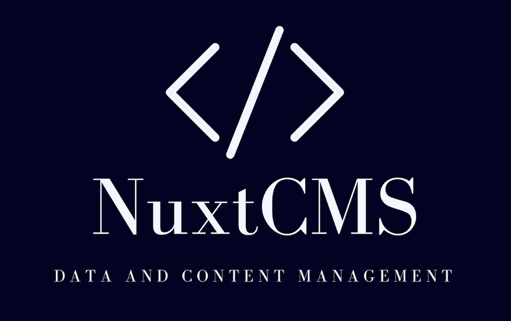
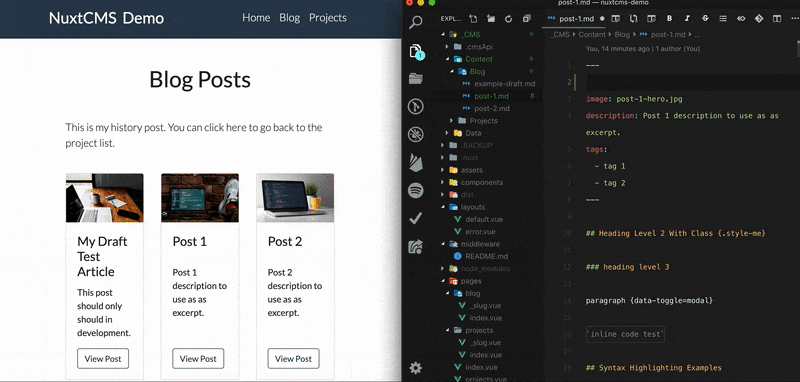

# :package: NuxtCMS

<div style="width: 680px; margin-left: auto; margin-right: auto;">

  
</div>

[![npm version][npm-version-src]][npm-version-href]
[![npm downloads][npm-downloads-src]][npm-downloads-href]
[![Circle CI][circle-ci-src]][circle-ci-href]
[![Codecov][codecov-src]][codecov-href]
[![Dependencies][david-dm-src]][david-dm-href]
[![Standard JS][standard-js-src]][standard-js-href]

> Nuxt.js module for managing your projects data and content.

## NuxtCMS Demo

<a target="_blank" rel="noopener" href="https://github.com/davidroyer/nuxtcms-demo">Github Repo</a> | <a target="_blank" rel="noopener" href="https://nuxtcms-demo.netlify.com/">Live Site</a>

<div style="width: 800px; margin-left: auto; margin-right: auto;">

  
</div>


[📖 **Release Notes**](./CHANGELOG.md)

## :heavy_check_mark: Features

- :memo: Write content in Markdown

- :card_file_box: Use YAML for data

- :lock: Can set content collection items to draft

- :mag: Easy access to get the content and data you need

- :label: Automatic tag API creation for any collections that include them in frontmatter
  <!-- - Easy & Consistent access -->

<br>

## :zap: The Quick Overview

1. :ballot_box_with_check: Everything lives in the `_CMS` directory
2. Two Directories for storing files
   - `Content` for Markdown collections
   - `Data` for Yaml collections and individual files
3. Everything can be accessed as `JSON` via the `$cmsApi.get()` method

<br>

## Example Directory Structure

```sh
# INSIDE NUXT SOUCE DIRECTORY

_CMS
├── Content
│   ├── Blog
│   ├── Markdown
│   └── Pages
└── Data
    ├── Courses
    └── Projects
    ├── menu.yml
    └── settings.yml
```

- Markdown files go inside subdirectories within `Content`

- Directory name of `Blog` is NOT customizable

- YAML files go inside within `Data` as files or inside subdirectories

- Subdirectories inside `Data` are considered "`DataCollections`"
  This means they will a slug and title will automatically be provided for each
  item within the collection so they can be used for dynamic route generation

## :page_facing_up: Using Your Content & Data

NuxtCMS provides a helper via `$cmsApi` that is available on the context and instance.

Whether you want all the items within a content type or a specific item, you use the same method, `$cmsApi.get()` to get both content and data. For example:

```js
const allProjects = $cmsApi.get("projects");
const specificProject = $cmsApi.get("projects", params.slug);
```

### Examples

#### In A Page Route

_Getting All Items Within a Data or Content Collection_

```js
asyncData({ $cmsApi }) {
    const articles = $cmsApi.get('articles')
    return { articles }
}
```

#### In A Dynamic Page Route

*Get An Item Within a Data or Content Collection*

```js
asyncData({ $cmsApi, params }) {
    const article = $cmsApi.get('articles', params.slug)
    return { article }
}
```

#### Within Vuex Store

```js
nuxtServerInit({ commit }, { $cmsApi }) {
  commit('setDataFileExample', $cmsApi.get('data-file-example'))
}
```

#### Within A Component

```jsx
computed: {
  nav() {
    return this.$cmsApi.get('nav-menu')
  }
}
```

## Using Provided Blog Styles

```html
<style src="@@/lib/assets/blog-styles.css"></style>
<style src="@@/node_modules/prismjs/themes/prism-tomorrow.css">
```

## Setup

1. Add `nuxtcms` dependency with `yarn` or `npm` into your project
2. Add `nuxtcms` to `modules` section of `nuxt.config.js`
3. Configure it:

```js
{
  modules: [
    // Simple usage
    "@droyer/nuxtcms",

    // With options
    [
      "@droyer/nuxtcms",
      {
        /* module options */
      }
    ]
  ];
}
```

## Options

The **Options go here**

<br>

## Development

1. Clone this repository
2. Install dependencies using `yarn install` or `npm install`
3. Start development server using `npm run dev`

## License

[MIT License](./LICENSE)

Copyright (c) David Royer <droyer01@gmail.com>

<!-- Badges -->

[npm-version-src]: https://img.shields.io/npm/dt/@droyer/nuxtcms.svg?style=flat-square
[npm-version-href]: https://npmjs.com/package/@droyer/nuxtcms
[npm-downloads-src]: https://img.shields.io/npm/v/@droyer/nuxtcms/latest.svg?style=flat-square
[npm-downloads-href]: https://npmjs.com/package/@droyer/nuxtcms
[circle-ci-src]: https://img.shields.io/circleci/project/github/davidroyer/nuxtcms.svg?style=flat-square
[circle-ci-href]: https://circleci.com/gh/davidroyer/nuxtcms
[codecov-src]: https://img.shields.io/codecov/c/github/davidroyer/nuxtcms.svg?style=flat-square
[codecov-href]: https://codecov.io/gh/davidroyer/nuxtcms
[david-dm-src]: https://david-dm.org/davidroyer/@droyer/nuxtcms/status.svg?style=flat-square
[david-dm-href]: https://david-dm.org/davidroyer/@droyer/nuxtcms
[standard-js-src]: https://img.shields.io/badge/code_style-standard-brightgreen.svg?style=flat-square
[standard-js-href]: https://standardjs.com
